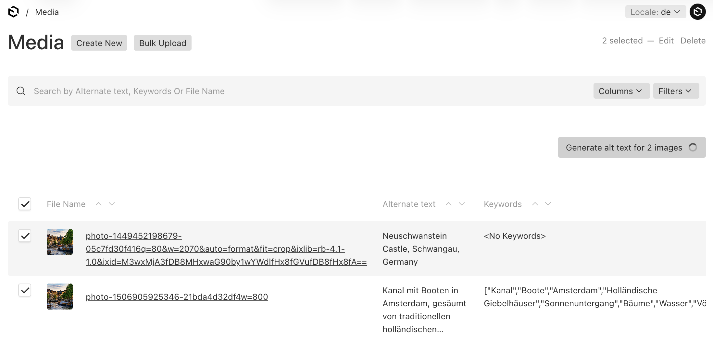

# Image Alt Text Generation Plugin for Payload CMS

A [Payload CMS](https://payloadcms.com/) plugin that adds AI-powered alt text generation for images. I automatically adds an alt text field with a button to generate the alt text to specified upload collections, and includes a bulk generation feature in the list view for processing multiple images at once.



## Features

- Generate alt text for images using AI in the Payload Admin UI
- Supports any AI provider using a resolver pattern (e.g., OpenAI, Anthropic, etc.)
- Comes with a ready-to-use OpenAI resolver out of the box
- Automatic keyword extraction for improved admin search
- Bulk generation for processing multiple images at once
- Full localization support


When the plugin is enabled for an upload collection, it will:

1. Add an alt text field to the collection
   - A button to AI-generate the alt text
   - This field will include a description of what the alt text should be
2. Add a keywords fields to the collection
   - This field will be automatically filled when generating the alt text 
   - It will be used for improving the search of images in the admin panel
2. Add a bulk generate button to the collection list view
   - This button will allow you to generate alt text for multiple images at once

## Installation

```bash
pnpm add @jhb.software/payload-alt-text-plugin
```

## Setup

Install the plugin and add it to your Payload config:

```ts
import {
  payloadAltTextPlugin,
  openAIResolver,
} from '@jhb.software/payload-alt-text-plugin'

export default buildConfig({
  plugins: [
    payloadAltTextPlugin({
      collections: ['media'],
      resolver: openAIResolver({
        apiKey: process.env.OPENAI_API_KEY,
        model: 'gpt-4.1-mini', // optional, defaults to 'gpt-4.1-nano'
      }),
      getImageThumbnail: (doc) => doc.url, // a function to get a thumbnail URL (e.g. from the sizes)
    }),
  ],
})
```

Note: When localization is disabled in your Payload config (default), you need to specify the locale to generate the alt texts in via the `locale` plugin option.

## Configuration

### Plugin Options

| Option                       | Type               | Required | Description                                                              |
| ---------------------------- | ------------------ | -------- | ------------------------------------------------------------------------ |
| `collections`                | `CollectionSlug[]` | Yes      | Collections to enable alt text generation for                            |
| `resolver`                   | `AltTextResolver`  | Yes      | Alt text resolver to use (e.g., `openAIResolver`)                        |
| `getImageThumbnail`          | `Function`         | Yes      | Function to get the thumbnail URL from an image document                 |
| `enabled`                    | `boolean`          | No       | Whether to enable the plugin                                             |
| `locale`                     | `string`           | No       | Locale for alt text generation (required when localization is disabled)  |
| `maxBulkGenerateConcurrency` | `number`           | No       | Maximum concurrent API requests for bulk operations (default: 16)        |
| `fieldsOverride`             | `Function`         | No       | Override the default fields inserted by the plugin                       |

### Resolvers

This plugin is designed to work seamlessly with various AI providers by accepting a customizable resolver as a configuration option.

An OpenAI resolver is provided out of the box, but you can use any AI provider by creating your own resolver and specifying it in the plugin configuration.

#### OpenAI Resolver

```ts
import { openAIResolver } from '@jhb.software/payload-alt-text-plugin'

openAIResolver({
  apiKey: process.env.OPENAI_API_KEY,
  model: 'gpt-4.1-mini', // or 'gpt-4.1-nano' (default)
})
```

## Custom Resolver

You can create your own resolver by implementing the `AltTextResolver` interface.

```ts
import type { AltTextResolver } from '@jhb.software/payload-alt-text-plugin'

export const customResolver = (): AltTextResolver => ({
  key: 'custom',
  resolve: async ({ imageThumbnailUrl, filename, locale, req }) => {
    // Your custom alt text generation logic here
    const altText = await generateAltText(imageThumbnailUrl, filename, locale, req)

    return {
      success: true,
      result: altText,
    }
  },
  resolveBulk: async ({ imageThumbnailUrl, filename, locales, req }) => {
     // Your custom alt text generation logic here
    const altTexts = await generateAltTextBulk(imageThumbnailUrl, filename, locales, req)

    return { 
      success: true, 
      results: altTexts 
    }
  },
})
```

## Roadmap

> **Warning**: This plugin is actively evolving and may undergo significant changes. While it is functional, please thoroughly test before using in production environments.

Have a suggestion for the plugin? Any feedback is welcome!

## Contributing

We welcome contributions! Please open an issue to report bugs or suggest improvements, or submit a pull request with your changes.
